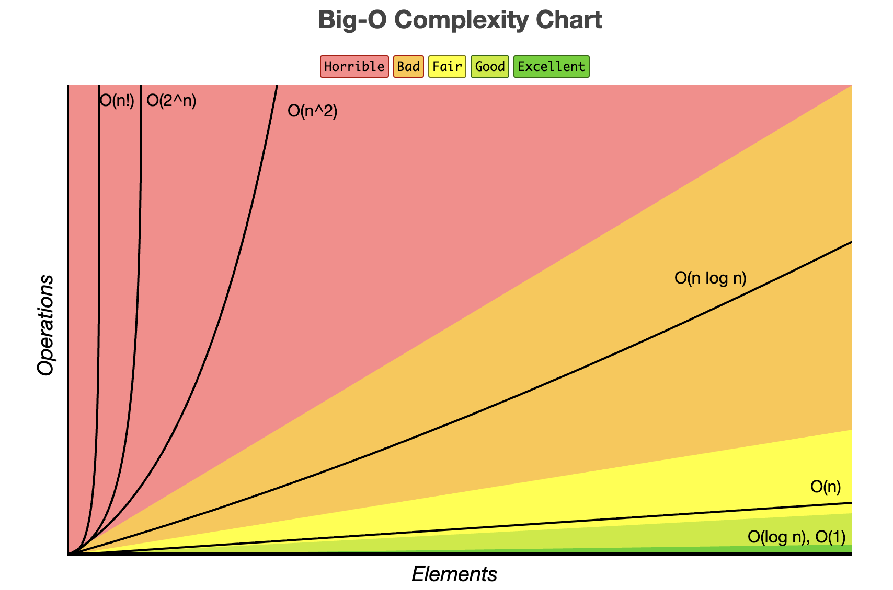

# Complete Guide to Big O Notation - Algorithm Analysis

## Table of Contents
1. [Introduction](#introduction)
2. [What is Big O Notation?](#what-is-big-o-notation)
3. [Why Do We Need Big O?](#why-do-we-need-big-o)
4. [Time Complexity vs Space Complexity](#time-complexity-vs-space-complexity)
5. [Common Big O Notations](#common-big-o-notations)
6. [Rules for Calculating Big O](#rules-for-calculating-big-o)
7. [Detailed Analysis with Examples](#detailed-analysis-with-examples)
8. [Best, Average, and Worst Case](#best-average-and-worst-case)
9. [Space Complexity Analysis](#space-complexity-analysis)
10. [Big O Cheat Sheet](#big-o-cheat-sheet)

---

## Introduction
Data structures are defined as methods for organizing information in memory, while algorithms are the specific logical steps used to solve problems. By mastering these tools, developers can minimize hardware costs, reduce CPU cycles, and significantly improve user experience.

### The Science of Algorithm Analysis
When faced with multiple correct solutions to a single problem, how do we determine which one is "better"? The results would depend on the machine's speed, the programming language, and the system's current load. To overcome these variables, we use a powerful theoretical tool called **Asymptotic Analysis**. It is the mathematical framework that allows us to formally compare algorithms. Its core idea is to evaluate the "order of growth" of an algorithm's runtime not on a specific machine, but as the input size (n) tends to infinity. It provides a high-level description of how an algorithm's runtime scales with the size of its input. 

### The Language of Efficiency: Asymptotic Notations

To speak precisely about efficiency, engineers use three core mathematical notations: Big O, Big Omega, and Theta.

***Dominant term rule***

In Big-O, g(n) is chosen as the dominant (highest-order) term of f(n).

Examples:

| f(n)          | Dominant term | g(n)      |
|---------------|---------------|-----------|
| 2n + 3        | n             | n         |
| 5n² + 7n + 10 | n²            | n²        |
| log n + n     | n             | n         |
| n log n + n   | n log n       | n log n   |


***Big O Notation (O)*** - The Upper Bound
Big O notation describes an upper bound on an algorithm's runtime. This means the algorithm's performance will be at most a certain order of growth; it could be better, but it will never be worse. Its primary use case is to describe the worst-case scenario, which is often the most critical metric for performance guarantees. Mathematical Definition : A function f(n) is O(g(n)) if there exist positive constants c and n₀ such that f(n) ≤ c * g(n) for all n ≥ n₀.
For example, the function f(n) = 2n + 3 is O(n). This can be proven by finding constants c=3 and n₀=3, for which the inequality 2n + 3 ≤ 3n holds true for all n ≥ 3.

***Big Omega Notation (Ω)*** - The Lower Bound
Big Omega notation describes a lower bound on an algorithm's runtime. This means the algorithm's performance will be at least a certain order of growth; it could be worse, but it will never be better. Use Big Omega to describe the best-case scenario. You also use it to state a hard lower limit on an algorithm's runtime, like when an algorithm that must process n items will always take at least Ω(n) time just to initialize its data. Mathematical Definition: A function f(n) is Ω(g(n)) if there exist positive constants c and n₀ such that f(n) ≥ c * g(n) for all n ≥ n₀.
For the same function f(n) = 2n + 3, we can say it is Ω(n). This is proven with constants c=1 and n₀=0, for which the inequality 2n + 3 ≥ 1n holds true for all n ≥ 0.

***Theta Notation (Θ)*** - The Tight Bound
Theta notation describes a tight or exact bound. It is used when an algorithm's performance is bounded from both above and below by the same order of growth. This is the most precise notation and should be used whenever the exact order of growth is known. For example, an algorithm to find the maximum element in an unsorted array will always take linear time, so its complexity is Θ(n).
• Mathematical Definition: A function f(n) is Θ(g(n)) if there exist positive constants c1, c2, and n₀ such that c1 * g(n) ≤ f(n) ≤ c2 * g(n) for all n ≥ n₀.

### Real-World Analogy
Think of Big O like describing travel times:
- **O(1)**: Taking an elevator directly to your floor
- **O(log n)**: Finding a word in a dictionary using binary search
- **O(n)**: Reading every page of a book
- **O(n²)**: Checking every seat combination in a theater
- **O(2ⁿ)**: Trying every possible combination of a password

---

## What is Big O Notation?

Big O notation is a way to express the **upper bound** of an algorithm's running time. It characterizes functions according to their growth rates, helping us understand how an algorithm scales.

### Mathematical Definition
If f(n) and g(n) are two functions, we say:
```
f(n) = O(g(n))
```
if there exist positive constants c and n₀ such that:
```
0 ≤ f(n) ≤ c·g(n) for all n ≥ n₀
```

### Simplified Understanding
Big O tells us: "In the worst case, how does the runtime/memory grow relative to the input size?"

---

## Why Do We Need Big O?

### 1. **Platform Independence**
- Code runs differently on different machines
- Big O provides machine-independent analysis
- Focus on algorithmic efficiency, not hardware

### 2. **Scalability Prediction**
```
Input Size (n)    O(n)      O(n²)     O(2ⁿ)
─────────────────────────────────────────────
10                10 ms     100 ms    1 sec
100               100 ms    10 sec    eternal
1,000             1 sec     17 min    eternal
10,000            10 sec    1 day     eternal
```

### 3. **Algorithm Comparison**
- Compare algorithms objectively
- Choose the right algorithm for the problem
- Optimize where it matters most

---

## Time Complexity vs Space Complexity

### Time Complexity
Measures **how long** an algorithm takes to complete as input size grows.

**Example:**
```python
def print_items(n):
    for i in range(n):  # This loop runs n times
        print(i)        # Each print is O(1)
    # Total: O(n)
```

### Space Complexity
Measures **how much memory** an algorithm uses as input size grows.

**Example:**
```python
def create_array(n):
    arr = []
    for i in range(n):
        arr.append(i)   # Creating n elements
    return arr
    # Space: O(n)
```

---

## Common Big O Notations

### Visual Representation



### Complexity Ranking (Best to Worst)
```
O(1) < O(log n) < O(n) < O(n log n) < O(n²) < O(n³) < O(2ⁿ) < O(n!)
```

---

## Rules for Calculating Big O

### Rule 1: Drop Constants
**Why?** Big O describes growth rate, not exact time.

```python
# Example 1
def print_twice(n):
    for i in range(n):      # O(n)
        print(i)
    for i in range(n):      # O(n)
        print(i)
    # Total: O(n) + O(n) = O(2n) = O(n) ✓
```

**Simplification:** O(2n) → O(n), O(500) → O(1)

### Rule 2: Drop Non-Dominant Terms
**Why?** For large n, smaller terms become insignificant.

```python
# Example 2
def complex_function(n):
    for i in range(n):              # O(n)
        for j in range(n):          # O(n²)
            print(i, j)
    for k in range(n):              # O(n)
        print(k)
    # Total: O(n²) + O(n) = O(n²) ✓
```

**Simplification:**
- O(n² + n) → O(n²)
- O(n³ + n² + n) → O(n³)
- O(n + log n) → O(n)

### Rule 3: Different Inputs = Different Variables
```python
def two_arrays(arr1, arr2):
    for i in arr1:              # O(a) where a = len(arr1)
        print(i)
    for j in arr2:              # O(b) where b = len(arr2)
        print(j)
    # Total: O(a + b) ✓
    # NOT O(n) because they're different inputs!
```

### Rule 4: Nested Loops = Multiplication
```python
def nested_loops(arr1, arr2):
    for i in arr1:              # O(a)
        for j in arr2:          # O(b)
            print(i, j)
    # Total: O(a × b) ✓
```

---

## Detailed Analysis with Examples

### 1. O(1) - Constant Time
**Definition:** Runtime doesn't depend on input size.

```python
def get_first_element(arr):
    if len(arr) > 0:
        return arr[0]    # Always one operation
    return None
    # Time: O(1)

def add_numbers(a, b):
    return a + b         # One operation
    # Time: O(1)
```

**Visual:**
```
Runtime
   │
   │ ████████████████████████
   │
   └─────────────────────────→ Input Size (n)
```

**Real Examples:**
- Accessing array element by index
- Hash table lookup (average case)
- Inserting at the beginning of a linked list
- Stack push/pop operations

---

### 2. O(log n) - Logarithmic Time
**Definition:** Runtime grows logarithmically with input size.

**Binary Search Example:**
```python
def binary_search(arr, target):
    left, right = 0, len(arr) - 1
    
    while left <= right:
        mid = (left + right) // 2
        
        if arr[mid] == target:
            return mid
        elif arr[mid] < target:
            left = mid + 1      # Cut search space in half
        else:
            right = mid - 1     # Cut search space in half
    
    return -1
    # Time: O(log n)
```

**How Binary Search Works:**
```
Array: [1, 3, 5, 7, 9, 11, 13, 15, 17, 19]  (n = 10)
Target: 13

Step 1: Check middle (9)  → Too small, search right half
        [11, 13, 15, 17, 19]  (n = 5)

Step 2: Check middle (15) → Too large, search left half
        [11, 13]  (n = 2)

Step 3: Check middle (11) → Too small, search right half
        [13]  (n = 1)

Step 4: Found! ✓

Steps taken: 4 = log₂(10) ≈ 3.32 → rounds to 4
```

**Why O(log n) is Efficient:**
```
Input Size (n)    Operations (log₂ n)
──────────────────────────────────────
1                 0
2                 1
4                 2
8                 3
16                4
1,024             10
1,048,576         20
```

**Real Examples:**
- Binary search in sorted array
- Balanced binary search tree operations
- Finding an element in a sorted rotated array

---

### 3. O(n) - Linear Time
**Definition:** Runtime grows directly proportional to input size.

```python
def print_all_elements(arr):
    for item in arr:        # Iterates n times
        print(item)         # O(1) operation
    # Time: O(n)

def find_max(arr):
    max_val = arr[0]
    for num in arr:         # Iterates n times
        if num > max_val:
            max_val = num
    return max_val
    # Time: O(n)
```

**Visual:**
```
Runtime
   │                         ●
   │                       ●
   │                     ●
   │                   ●
   │                 ●
   │               ●
   │             ●
   │           ●
   │         ●
   │       ●
   │     ●
   │   ●
   │ ●
   └─────────────────────────────→ Input Size (n)
   
Linear Growth: Runtime increases proportionally with input size
```

**Real Examples:**
- Finding an element in unsorted array
- Printing all elements
- Calculating sum/average of array
- Linear search

---

### 4. O(n log n) - Linearithmic Time
**Definition:** Runtime is n multiplied by log n.

**Merge Sort Example:**
```python
def merge_sort(arr):
    if len(arr) <= 1:
        return arr
    
    mid = len(arr) // 2
    left = merge_sort(arr[:mid])      # Divide: O(log n) levels
    right = merge_sort(arr[mid:])
    
    return merge(left, right)          # Merge: O(n) work per level
    # Time: O(n log n)

def merge(left, right):
    result = []
    i = j = 0
    
    while i < len(left) and j < len(right):
        if left[i] <= right[j]:
            result.append(left[i])
            i += 1
        else:
            result.append(right[j])
            j += 1
    
    result.extend(left[i:])
    result.extend(right[j:])
    return result
```

**Merge Sort Visual:**
```
Array: [38, 27, 43, 3, 9, 82, 10]

Level 0:     [38, 27, 43, 3, 9, 82, 10]           ← O(n) work
            /                          \
Level 1:   [38, 27, 43]              [3, 9, 82, 10]  ← O(n) work
          /           \              /            \
Level 2: [38]  [27, 43]          [3, 9]      [82, 10] ← O(n) work
              /    \             /    \       /     \
Level 3:    [27]  [43]        [3]   [9]   [82]   [10] ← O(n) work

Total Levels: log₂(7) ≈ 3
Work per level: O(n)
Total: O(n log n)
```

**Real Examples:**
- Merge sort
- Quick sort (average case)
- Heap sort
- Efficient sorting algorithms

---

### 5. O(n²) - Quadratic Time
**Definition:** Runtime is proportional to the square of input size.

```python
def bubble_sort(arr):
    n = len(arr)
    for i in range(n):              # Outer loop: n times
        for j in range(n - i - 1):  # Inner loop: n times (worst case)
            if arr[j] > arr[j + 1]:
                arr[j], arr[j + 1] = arr[j + 1], arr[j]
    return arr
    # Time: O(n²)

def print_pairs(arr):
    for i in range(len(arr)):       # n times
        for j in range(len(arr)):   # n times
            print(arr[i], arr[j])
    # Time: O(n²)
```

**Visual:**
```
Array: [5, 3, 8, 1]  (n = 4)

Comparisons in Bubble Sort:
Pass 1: 5-3, 3-8, 8-1  → 3 comparisons
Pass 2: 3-5, 5-1, 1-8  → 3 comparisons
Pass 3: 3-1, 1-5, 5-8  → 3 comparisons
Pass 4: 1-3, 3-5, 5-8  → 3 comparisons

Total: ~12 comparisons ≈ n²
```

**Growth Table:**
```
Input Size (n)    Operations (n²)
─────────────────────────────────
10                100
100               10,000
1,000             1,000,000
10,000            100,000,000
```

**Real Examples:**
- Bubble sort
- Selection sort
- Insertion sort
- Checking all pairs in array
- Nested loops over same data

---

### 6. O(2ⁿ) - Exponential Time
**Definition:** Runtime doubles with each additional element.

**Fibonacci (Recursive) Example:**
```python
def fibonacci(n):
    if n <= 1:
        return n
    return fibonacci(n-1) + fibonacci(n-2)
    # Time: O(2ⁿ)
```

**Recursion Tree for fib(5):**
```
                    fib(5)
                   /      \
              fib(4)        fib(3)
             /     \        /     \
        fib(3)   fib(2)  fib(2)  fib(1)
        /   \     /   \   /   \
    fib(2) fib(1) ...  ...  ...
    /   \
fib(1) fib(0)

Total calls: 1 + 2 + 4 + 8 + ... ≈ 2ⁿ
```

**Why It's Exponential:**
- Each call branches into 2 more calls
- Creates a binary tree of depth n
- Total nodes ≈ 2ⁿ

**Growth Table:**
```
n       2ⁿ (approx. operations)
────────────────────────────────
5       32
10      1,024
15      32,768
20      1,048,576
30      1,073,741,824  (1 billion!)
```

**Real Examples:**
- Recursive fibonacci
- Generating all subsets of a set
- Solving Tower of Hanoi
- Brute force password cracking

---

### 7. O(n!) - Factorial Time
**Definition:** Runtime grows factorially with input size.

**Generating Permutations:**
```python
def permutations(arr):
    if len(arr) == 0:
        return [[]]
    
    result = []
    for i in range(len(arr)):
        rest = arr[:i] + arr[i+1:]
        for p in permutations(rest):
            result.append([arr[i]] + p)
    
    return result
    # Time: O(n!)
```

**Example - Permutations of [A, B, C]:**
```
Level 0: Choose 1st position (3 choices)
         A, B, C

Level 1: For each, choose 2nd position (2 choices each)
         A-B, A-C, B-A, B-C, C-A, C-B

Level 2: For each, choose 3rd position (1 choice each)
         ABC, ACB, BAC, BCA, CAB, CBA

Total: 3 × 2 × 1 = 3! = 6 permutations
```

**Growth Table:**
```
n       n! (operations)
───────────────────────
5       120
10      3,628,800
15      1,307,674,368,000
20      2,432,902,008,176,640,000
```

**Real Examples:**
- Generating all permutations
- Traveling salesman problem (brute force)
- Solving some NP-complete problems

---

## Best, Average, and Worst Case

### Understanding Different Cases

```python
def linear_search(arr, target):
    for i in range(len(arr)):
        if arr[i] == target:
            return i
    return -1
```

**Scenarios:**
```
Array: [10, 20, 30, 40, 50]

Best Case (Ω):    Target = 10  → Found at index 0
                  Time: O(1)

Average Case (Θ): Target could be anywhere
                  Time: O(n/2) = O(n)

Worst Case (O):   Target = 50 or not present
                  Time: O(n)
```

### Notation Types
- **O (Big O)**: Upper bound (worst case)
- **Ω (Big Omega)**: Lower bound (best case)
- **Θ (Big Theta)**: Tight bound (average case)

### Visual Comparison
```
               Best    Average    Worst
Linear Search  O(1)    O(n)       O(n)
Binary Search  O(1)    O(log n)   O(log n)
Quick Sort     O(n log n) O(n log n) O(n²)
Merge Sort     O(n log n) O(n log n) O(n log n)
Hash Table     O(1)    O(1)       O(n)
```

---

## Space Complexity Analysis

### Understanding Space Complexity

Space complexity includes:
1. **Input space**: Space taken by inputs
2. **Auxiliary space**: Extra space used by algorithm
3. **Call stack space**: For recursive algorithms

### Example 1: O(1) Space
```python
def sum_array(arr):
    total = 0              # O(1) - single variable
    for num in arr:
        total += num
    return total
    # Space: O(1) - constant extra space
```

### Example 2: O(n) Space
```python
def create_copy(arr):
    new_arr = []          # O(n) - new array of size n
    for item in arr:
        new_arr.append(item)
    return new_arr
    # Space: O(n)
```

### Example 3: O(n) Space - Recursion
```python
def factorial(n):
    if n <= 1:
        return 1
    return n * factorial(n - 1)
    # Space: O(n) - call stack depth
```

**Call Stack Visualization for factorial(4):**
```
Stack Frame 4: factorial(4)
Stack Frame 3: factorial(3)
Stack Frame 2: factorial(2)
Stack Frame 1: factorial(1) → returns 1

Max Stack Depth: 4 = n
Space Complexity: O(n)
```

### Example 4: O(log n) Space - Binary Search
```python
def binary_search_recursive(arr, target, left, right):
    if left > right:
        return -1
    
    mid = (left + right) // 2
    if arr[mid] == target:
        return mid
    elif arr[mid] < target:
        return binary_search_recursive(arr, target, mid + 1, right)
    else:
        return binary_search_recursive(arr, target, left, mid - 1)
    # Space: O(log n) - recursion depth
```

**Recursion depth:** log₂(n) because we halve the search space each time.

### Trade-offs: Time vs Space

```python
# Approach 1: Time-efficient, Space-inefficient
def fibonacci_memoization(n, memo={}):
    if n in memo:
        return memo[n]
    if n <= 1:
        return n
    memo[n] = fibonacci_memoization(n-1, memo) + fibonacci_memoization(n-2, memo)
    return memo[n]
    # Time: O(n), Space: O(n)

# Approach 2: Space-efficient, Time-inefficient
def fibonacci_iterative(n):
    if n <= 1:
        return n
    a, b = 0, 1
    for _ in range(2, n + 1):
        a, b = b, a + b
    return b
    # Time: O(n), Space: O(1)

# Approach 3: Time-inefficient, Space-inefficient
def fibonacci_recursive(n):
    if n <= 1:
        return n
    return fibonacci_recursive(n-1) + fibonacci_recursive(n-2)
    # Time: O(2ⁿ), Space: O(n) - recursion depth
```

---

## Big O Cheat Sheet

### Data Structure Operations

```
┌─────────────────────┬──────────┬──────────┬──────────┬──────────┐
│ Data Structure      │  Access  │  Search  │  Insert  │  Delete  │
├─────────────────────┼──────────┼──────────┼──────────┼──────────┤
│ Array               │   O(1)   │   O(n)   │   O(n)   │   O(n)   │
│ Stack               │   O(n)   │   O(n)   │   O(1)   │   O(1)   │
│ Queue               │   O(n)   │   O(n)   │   O(1)   │   O(1)   │
│ Linked List         │   O(n)   │   O(n)   │   O(1)*  │   O(1)*  │
│ Hash Table          │   N/A    │   O(1)   │   O(1)   │   O(1)   │
│ Binary Search Tree  │  O(log n)│  O(log n)│  O(log n)│  O(log n)│
│ AVL Tree            │  O(log n)│  O(log n)│  O(log n)│  O(log n)│
│ Binary Heap         │   N/A    │   O(n)   │  O(log n)│  O(log n)│
└─────────────────────┴──────────┴──────────┴──────────┴──────────┘
* At known position
```

### Sorting Algorithms

```
┌─────────────────┬───────────┬───────────┬───────────┬──────────┐
│ Algorithm       │   Best    │  Average  │   Worst   │  Space   │
├─────────────────┼───────────┼───────────┼───────────┼──────────┤
│ Bubble Sort     │   O(n)    │   O(n²)   │   O(n²)   │   O(1)   │
│ Selection Sort  │   O(n²)   │   O(n²)   │   O(n²)   │   O(1)   │
│ Insertion Sort  │   O(n)    │   O(n²)   │   O(n²)   │   O(1)   │
│ Merge Sort      │ O(n log n)│ O(n log n)│ O(n log n)│   O(n)   │
│ Quick Sort      │ O(n log n)│ O(n log n)│   O(n²)   │ O(log n) │
│ Heap Sort       │ O(n log n)│ O(n log n)│ O(n log n)│   O(1)   │
│ Counting Sort   │  O(n+k)   │  O(n+k)   │  O(n+k)   │   O(k)   │
│ Radix Sort      │  O(nk)    │  O(nk)    │  O(nk)    │  O(n+k)  │
└─────────────────┴───────────┴───────────┴───────────┴──────────┘
```

### Searching Algorithms

```
┌─────────────────┬───────────┬───────────┬──────────┐
│ Algorithm       │   Best    │   Worst   │  Space   │
├─────────────────┼───────────┼───────────┼──────────┤
│ Linear Search   │   O(1)    │   O(n)    │   O(1)   │
│ Binary Search   │   O(1)    │  O(log n) │   O(1)   │
│ Jump Search     │   O(1)    │   O(√n)   │   O(1)   │
│ DFS (Graph)     │   O(1)    │  O(V+E)   │   O(V)   │
│ BFS (Graph)     │   O(1)    │  O(V+E)   │   O(V)   │
└─────────────────┴───────────┴───────────┴──────────┘
```

---

## Practice Problems with Solutions

### Problem 1: Identify Time Complexity

```python
# Code Snippet 1
def mystery1(n):
    for i in range(n):
        for j in range(n):
            print(i, j)
```
**Answer:** O(n²) - Two nested loops, each running n times.

---

```python
# Code Snippet 2
def mystery2(n):
    i = 1
    while i < n:
        print(i)
        i *= 2
```
**Answer:** O(log n) - i doubles each iteration (1, 2, 4, 8, ..., n)

---

```python
# Code Snippet 3
def mystery3(arr):
    n = len(arr)
    for i in range(n):
        print(arr[i])
    
    for i in range(n):
        for j in range(n):
            print(arr[i], arr[j])
```
**Answer:** O(n²) - First loop is O(n), second is O(n²). Dominant term is O(n²).

---

```python
# Code Snippet 4
def mystery4(n):
    if n <= 1:
        return n
    return mystery4(n-1) + mystery4(n-1)
```
**Answer:** O(2ⁿ) - Each call makes 2 recursive calls.

---

```python
# Code Snippet 5
def mystery5(arr1, arr2):
    for i in arr1:
        print(i)
    
    for j in arr2:
        for k in arr2:
            print(j, k)
```
**Answer:** O(a + b²) where a = len(arr1), b = len(arr2)

---

### Problem 2: Optimize Algorithms

**Inefficient Version (O(n²)):**
```python
def find_duplicates(arr):
    duplicates = []
    for i in range(len(arr)):
        for j in range(i + 1, len(arr)):
            if arr[i] == arr[j] and arr[i] not in duplicates:
                duplicates.append(arr[i])
    return duplicates
```

**Optimized Version (O(n)):**
```python
def find_duplicates_optimized(arr):
    seen = set()
    duplicates = set()
    
    for num in arr:
        if num in seen:
            duplicates.add(num)
        else:
            seen.add(num)
    
    return list(duplicates)
    # Time: O(n), Space: O(n)
```

---

### Problem 3: Space Complexity Analysis

```python
def create_2d_array(n):
    matrix = []
    for i in range(n):
        row = []
        for j in range(n):
            row.append(i * j)
        matrix.append(row)
    return matrix
```

**Analysis:**
- Creates n rows
- Each row has n elements
- Total elements: n × n
- **Space Complexity: O(n²)**

---

## Common Mistakes to Avoid

### Mistake 1: Confusing Input Size
```python
# WRONG: Saying this is O(n)
def process_matrix(matrix):
    rows = len(matrix)
    cols = len(matrix[0])
    for i in range(rows):
        for j in range(cols):
            print(matrix[i][j])

# CORRECT: O(r × c) or O(n) where n = total elements
```

### Mistake 2: Ignoring Hidden Operations
```python
# This looks O(n) but...
def example(arr):
    for item in arr:
        if item in arr:  # This is O(n) operation!
            print(item)
# Actual: O(n²)
```

### Mistake 3: Forgetting About Space
```python
def reverse_string(s):
    return s[::-1]  # Creates a new string
    # Time: O(n), Space: O(n)
    # Not O(1) space!
```

---

## Tips for Interview Success

### 1. **Always State Your Assumptions**
- "I'm assuming the array is sorted..."
- "If n is the length of the input..."

### 2. **Think Out Loud**
```
Step 1: Understand the problem
Step 2: Consider brute force approach (what's the time complexity?)
Step 3: Can we optimize? Use better data structure?
Step 4: Consider trade-offs (time vs space)
Step 5: Test with examples
```

### 3. **Master These Patterns**
- Two pointers: Often reduces O(n²) to O(n)
- Hash maps: Trade space for time (O(n²) → O(n))
- Sorting: Sometimes O(n log n) preprocessing helps
- Divide and conquer: Often leads to O(log n) or O(n log n)

### 4. **Common Optimizations**

**Pattern 1: Use Hash Map**
```python
# Before: O(n²)
def two_sum_slow(arr, target):
    for i in range(len(arr)):
        for j in range(i+1, len(arr)):
            if arr[i] + arr[j] == target:
                return [i, j]

# After: O(n)
def two_sum_fast(arr, target):
    seen = {}
    for i, num in enumerate(arr):
        complement = target - num
        if complement in seen:
            return [seen[complement], i]
        seen[num] = i
```

**Pattern 2: Two Pointers**
```python
# Before: O(n²) with nested loops
# After: O(n) with two pointers

def remove_duplicates(arr):
    if not arr:
        return 0
    
    write_ptr = 1
    for read_ptr in range(1, len(arr)):
        if arr[read_ptr] != arr[read_ptr - 1]:
            arr[write_ptr] = arr[read_ptr]
            write_ptr += 1
    
    return write_ptr
```

---

## Final Thoughts

### Remember
> "Premature optimization is the root of all evil." - Donald Knuth

- Write correct code first
- Optimize when needed
- Measure before optimizing
- Big O guides decisions, not microoptimizations

---